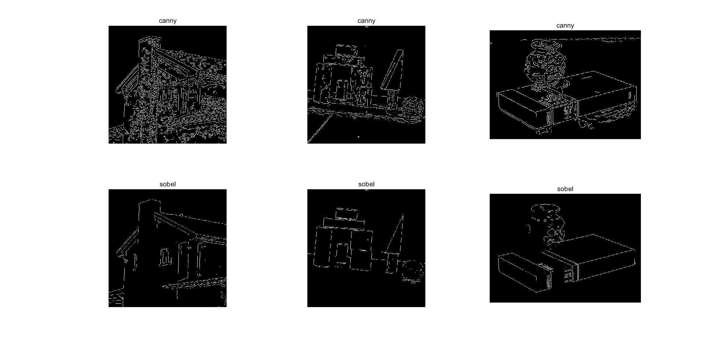
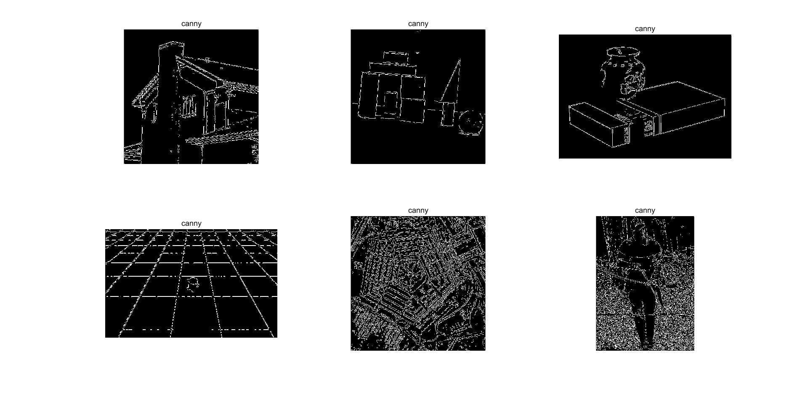
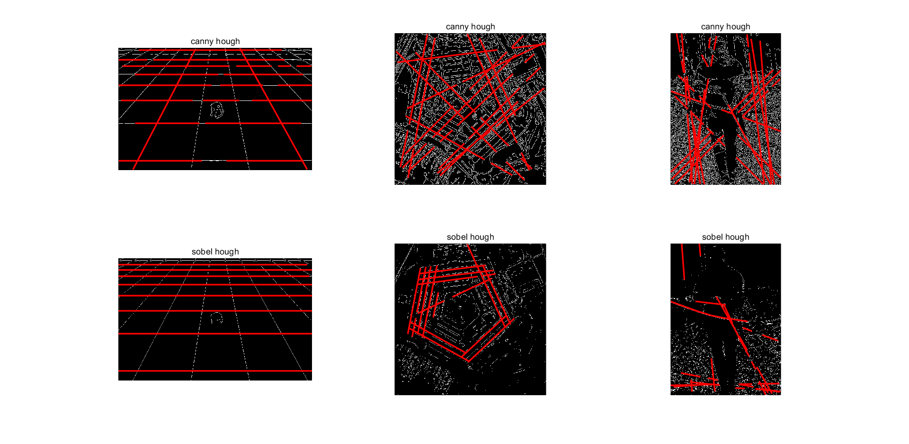
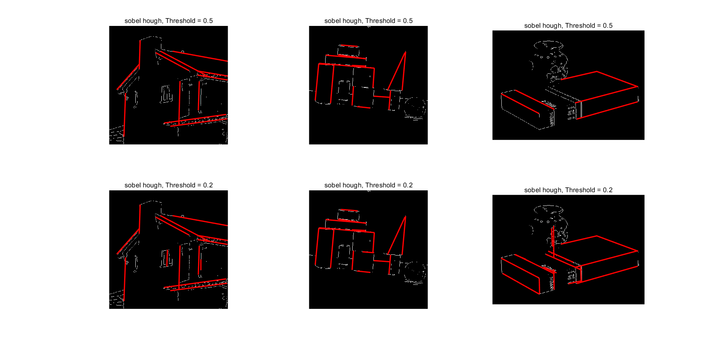
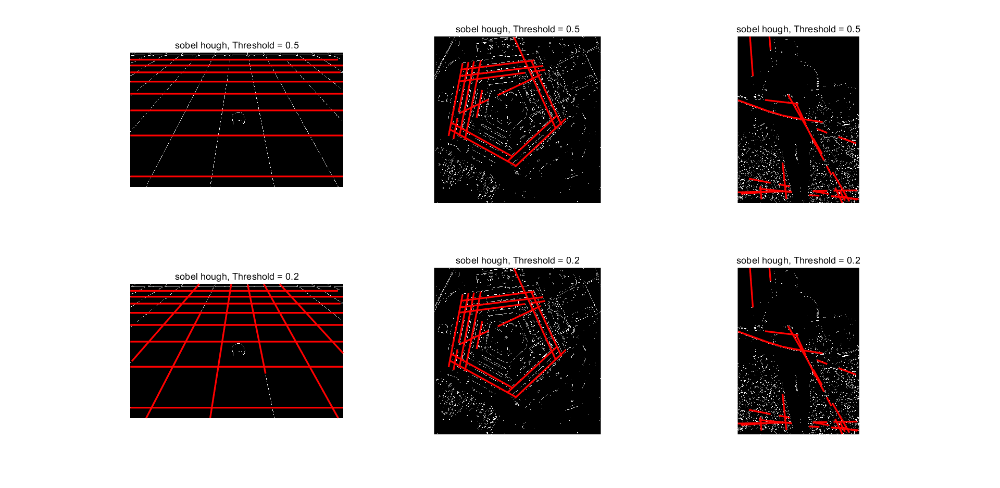
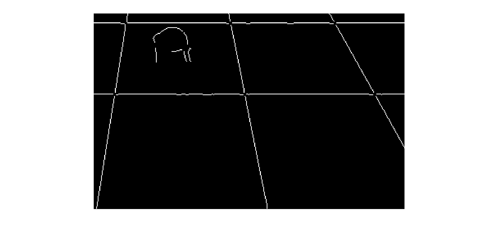

#数字图像处理第七次作业
1. 姓名：周瑞虎
2. 班级：自动化61
3. 学号：2160504027
4. 提交日期：2019/5/15
***
###       摘要：霍夫直线检测把原本需要大量计算求直线的运算量降低了很多，其主要思想就是把直角坐标和极坐标转换，遍历所有像素，找到极坐标曲线交点数比较多的点则是原本图像里面的确定实现所用的参数，而且霍夫检测的思想还可以用在检测其他参数方程描述的曲线中去，而在这之前就是要先把原图像做边缘检测，然后再利用霍夫检测的方法检测原图像中的曲线。
***

### 1. 首先对测试图像（文件名为：test1~test6）进行边缘检测，可采用书上介绍的Sobel等模板或者canny算子方法；

其中上面两张图就是我使用matlab自带函数检测的结果，由于以前的作业也曾写过使用canny算法和sobel算子检测图像的边缘，sobe算子就是使用sobel算子做相关运算，canny算法检测边缘的思想可以基本概括为以下几个步骤：

1.使用高斯滤波器平滑处理图像

2.使用一阶偏导的有限差分进行计算梯度

3.对梯度幅值进行非极大值抑制

4.使用双阈值算法检测和连接边缘

其中在编程的时候，比较难以选择的是，在阈值选择的时候的大小阈值，其中matlab的canny算法并不能看出来是怎么选择阈值的，但是我用自己之前做过的canny算法对这些进行了检测，效果如下：

虽然说效果提升了，但是付出的代价是时间，我的算法跑的比较慢，可能是还不是很了解matlab编程技巧，导致代码执行效率很低，自己编写的canny算法的阈值是根据书上的值所设定的（大小阈值分别是0.1，0.04）。从图中可以总结出，如果图像边缘信息比较简单，类似于前四幅图，canny检测效果是比较好的比起sobel方法来说，不会出现断边的情况，但是，但是遇到细节非常丰富的图片，像倒数两幅图片，canny保留下的杂乱信息太多，而使用sobel算法检测后并用阈值处理的效果还是比较好的，保留下来的杂乱信息少很多。因为这个原因，在接下来的hough检测中，使用sobel得到的边缘信息，虽然有断边，但是hough检测是可以克服这个问题的。

### 2. 在边缘检测的基础上，用hough变换检测图中直线；比较不同边缘检测算法（2种以上）

hough直线检测的思想是，一个直线的方程可以写成$\rho = xcos(\theta) + ysin(\theta)$，把x和看y作是参数，因为在图像坐标系中，$\rho$和$\theta$都是有限值，因而遍历所有像素点，对这个两个值做等间隔划分，做出以$\rho$和$\theta$为变量的函数曲线，之后，找到曲线交点最多的点，由该点处的$\rho$和$\theta$的就可以确定一条直线。显然这两个值间隔越小，精度越高，本次实验使用的是，间隔分别为1，0.5度（范围是-90至90）。

其中每个图片的上三个图是使用canny算法得出的结果进行hough检测后的结果，下面图片是使用sobel算法的结果，其中霍夫直线检测部分使用的参数都是相同的，可以看出，因为canny算法保留了更多的边缘，检测到的直线比较多，当然，在杂乱信息比较多的时候，也检测到了一些多余的直线。

### 3. 比较不同hough变换参数对直线检测的影响；

在基于投票选出交点数最多的一部分参数的时候，一般是选择大于某一个阈值就选择这个参数为直线参数的方法，这个阈值在matlab函数中，默认为0.5*max，max是交点数最多的数值，下面图片选用的是使用sobel检测后的边缘信息，阈值分别选为 0.5 * max（上方的检测结果），0.2 * max（下方的检测结果），可以看出，降低阈值的确可以把一些漏掉的直线补上（如test3），变化最大的是test4的结果，之前的检测结果中不包含纵向直线（面向读者的直线），但是修改了之后可以检测到纵向直线。

针对为什么在阈值为 0.5  * max 检测不到纵向直线的问题，经过研究，发现第一条纵向直线的$\rho​$和$\theta​$值的排序为第9个，我发现横向直线的一致性很好，但是纵向直线的是一段一段的，类似于一小段直线不断平移形成的，这样的话就导致每个点对纵向直线的贡献不是很高，我猜想是这样的原因导致了该图中纵向直线不易检测。

